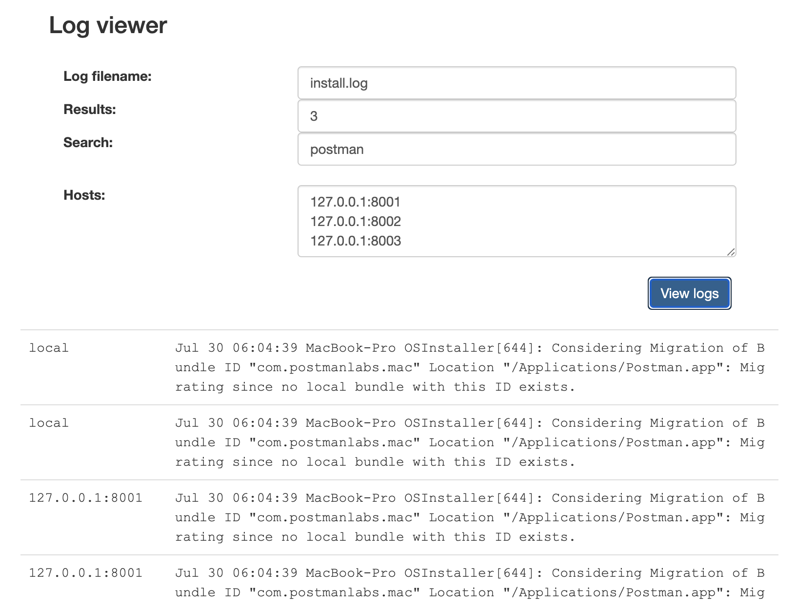

# Log Viewer Demo

A minimalistic distributed log viewer demo.

## Table of Contents

- [Installation](#installation)
- [Description](#description)
- [Usage](#usage)
- [License](#license)

## Description

This work is a PoC of a distributed log file viewer that reads logs located in /var/logs (by default). It exposes a REST API (e.g. for use with Postman) and includes a simple web interface if you open the root address on your browser. By default it allows returning up to 50 results per host, but you can change that in the constants. It can be used for the local machine only if you don't specify other hosts. If you enter one or more hostname:port values, the same search is performed on all these hosts (it's assumed that you install this tool and run it on these hosts). If you want to test the distributed feature locally, you can enter many 127.0.0.1:< port > and run the server in different ports (you'll get the same results for all searches in each host).



The intended use for this code is only experimetal, to learn and to use it as base for other projects. Don't use it in production.

Features:

- Reads any type of text file. It's format-agnostic.
- Can run in several ports. If no port is specified, a random+free port is assigned and displayed in the console at startup.
- There is no master/slave, and you can start servers in any order.
- Uses a mini dynamic task scheduler based on parallel promises to do proxy-style or lightweight operations.
- Uses worker threads for heavy CPU/Disk processing and keep the main thread unblocked.
- It's supposed to work with very big files. The log files are read in parts to use the smallest possible amount of memory.

Notes (space for improvement):

- Searches are done as entire phrase (not OR/AND keyords).
- No authentication layer is provided.
- No validation on input values.

## Installation

This code requires Node.js 12.9.0+

```sh
git clone https://github.com/lz-public/logviewer.git
npm install
```

## Usage

Run with auto-selected port:

```sh
npm start
```

On port 8000 (or any other):

```sh
npm start 8000
```

Browser UI Interface (assuming port 8000):

```sh
http://127.0.0.1:8000/
```

Tests:

```sh
npm test
```

## License

GNU Lesser General Public License v2.1
Available [here](https://github.com/lz-public/logviewer/blob/master/LICENSE).
